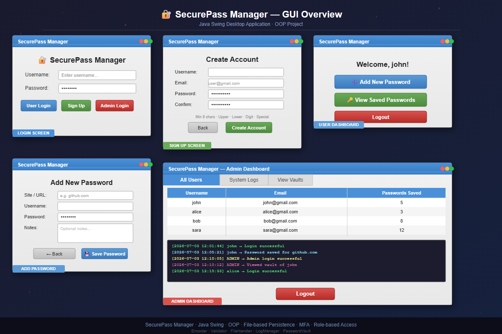

<div align="center">

# 🛡️ SecurePass Manager

[](https://openjdk.org/)
[](https://docs.oracle.com/javase/tutorial/uiswing/)
[](https://en.wikipedia.org/wiki/Base64)
[](LICENSE)

*A secure, local, multi-user desktop credential manager built on Java Swing.*

[Key Features](#-key-features) • [Application Showcase](#-application-showcase) • [Getting Started](#-getting-started) • [Project Structure](#-project-structure)

</div>

---

## 🔑 Key Features

### 👤 User Features
* **Double-Layer Authentication**: Register & log in securely using local profiles.
* **Multi-Factor Authentication (MFA)**: Adds an extra 6-digit MFA code challenge for all user accounts.
* **Personal Password Vault**:
  * **Add Credentials**: Log site names, usernames, passwords, and custom notes.
  * **Interactive Search & View**: Browse and manage your password entries in a structured list view.

### 🛡️ Admin Features
* **Secure Admin Access**: Access the administrative console with master admin credentials (`admin123` / MFA `123456`).
* **User Monitoring**: Audit registered users and view counts of their saved password entries.
* **Vault Inspection**: View raw encoded vault strings directly from the admin dashboard.
* **System Log Viewer**: Audit system activity logs (`system.log`) in real-time.

---

## 📸 Application Showcase

<div align="center">
  
</div>

---

## 🛠️ Getting Started

### Prerequisites
* **Java Development Kit (JDK) 8** or higher installed.

### Compilation and Run Instructions

1. **Clone the repository**:
   ```bash
   git clone https://github.com/Zabi-01/SecureUserCredentialManager.git
   cd SecureUserCredentialManager
   ```

2. **Compile the Java sources**:
   ```bash
   javac *.java
   ```

3. **Launch the application**:
   ```bash
   java SecurePassManager
   ```

---

## 📂 Project Structure

```text
SecureUserCredentialManager/
├── 📁 screenshots/          # UI Showcase assets
│   └── gui_showcase.png     # Application screenshot
├── 📁 users/                # [Local Only] Encrypted user profile and vault directories (git-ignored)
├── 📁 logs/                 # [Local Only] Application logs directory (git-ignored)
├── 📄 *.java                # Application source code
└── 📄 README.md             # Project documentation
```

---

<div align="center">
  Made with ❤️ for OOP Semester Project
</div>
